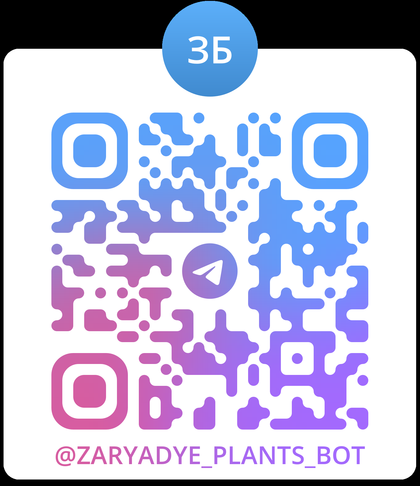

# Чат-бот "Зарядье'

## Оглавление

## Оглавление  
[1. Описание проекта](https://github.com/Eltralo/Project1/blob/main/.md#Описание-проекта)  
[2. Какой кейс решаем?](https://github.com/Eltralo/Project1/blob/main/README.md#Какой-кейс-решаем)  
[3. Краткая информация о данных](https://github.com/Eltralo/Projt1/blob/n/README.md#Краткая-информация-о-данных)  
[4. Этапы работы над проектом](https://github.com/Eltralo/Project1/blobin/README.md#Этапы-работы-над-проектом)  
[5. Результат](https://github.com/Eltralo/Project1/blob/maREADME.md#Результат)
[6. Тестирование и возможность установки]()
[6. Состав команды](https://github.com/Eltralo/Project1/blob/main/README.md#Результат)


### Описание проекта

В парке "Зарядье" на территории 10.2 гектара воссозданы четыре климатических зоны нашей страны: смешанный лес северный ландшафт, степь и заливные луга. В парке высажено много растений , как оригинальные, так и копии, адаптированные к московской погоде. 

Цель проекта : создать автоматический инструмент для улучшения опыта пребывания в парке. 

* Чат-бот "Зарядье" предоставляет информацию о растениях, высаженных в парке (латинское название, область где обычно произрастает, описание внешнего вида, интересные факты, климатичекую зону России), в том числе и в аудио-формате.[ссылка чат-бот]

* Справочник "Зарядье" предоставуляет различную информацию с иллюстрациями о растениях в парке. Мы предполагаем, что подобного рода справочники могут стоять на территории парка.[ссылка справочник]

### Какой кейс решаем

Пишем чат-бот, который будет использован в телеграмм.Для анализа текстовых отзывов использовалась модель BERT, а также библиотека fuzzivuzi        ---------------??????? надо немного подробнее

## Краткая информация о данных

Датасет взят с официального сайта mos.ru. Для доступа по API необходима регистрация. Для удобства датасет приложен по адресу [ссылка]


### Этапы работы над проектом

 * Поиск источника данных, выбор датасета
 * Подготовка данных, создание справочника [ссылка справочник]
 * Написание прототипа на gradio в colab, отработка модели и настройка
 * Осуществление возможности озвучивания информации
 * Создание бота и перенос туда всех функций 
 * Тестирование бота (результаты находятся [ссылка])
 * Выводы и результаты
 
 ### Результат

Чат-бот доступен по ссылке @zaryadye_plants_bot

QR-код



### Тестирование и возможность установки

Бот протестирован с использованием fuzz.partial_ratio. Написана функция, которая определяет насколько точно бот может идентифицировать растения на основе их названий, используя нечеткое сравнение строк. Он загружает данные о растениях, проверяет каждое название, сравнивает его с данными и выводит результаты тестирования, включая точность.

### Шаги  для установки
# Инструкция по установке проекта с GitHub

## Шаги для установки

1. **Скачайте проект из репозитория.**  
   Распакуйте его в выбранной папке.

2. **Перейдите в директорию проекта.**  
   Откройте терминал (Command Prompt или PowerShell) и выполните команду:
   ```bash
   cd C:\Users\Mikl\zaryadye_bot
   ```

3. **Создайте виртуальное окружение.**  
   Создайте виртуальное окружение с помощью `venv`, встроенного в Python. Выполните следующую команду:
   ```bash
   python -m venv venv
   ```
   Здесь `venv` — это имя директории, которая будет создана для хранения окружения. Вы можете выбрать другое имя, если хотите.

4. **Активируйте виртуальное окружение.**  
   Теперь активируйте созданное виртуальное окружение:

   - Если вы используете Command Prompt:
     ```bash
     venv\Scripts\activate
     ```
   - Если вы используете PowerShell:
     ```bash
     .\venv\Scripts\Activate.ps1
     ```

   После активации виртуального окружения вы увидите, что имя окружения (например, `(venv)`) добавлено перед командной строкой, что означает, что вы находитесь в активированном окружении.

5. **Установите зависимости из `requirements.txt`.**  
   Теперь, когда ваше виртуальное окружение активировано, выполните команду для установки зависимостей:
   ```bash
   pip install -r requirements.txt
   ```
   Эта команда прочитает файл `requirements.txt` и установит все перечисленные в нем зависимости.

6. **Создайте файл конфигурации.**  
   В директории проекта должен быть создан файл `config.py`, содержащий токен в следующем формате:
   ```python
   TOKEN = "Ваш токен телеграмм"
   ```

7. **Проверьте установленные зависимости (по желанию).**  
   Вы можете проверить, что все зависимости были установлены успешно, выполнив команду:
   ```bash
   pip list
   ```

8. **Деактивируйте виртуальное окружение (по желанию).**  
   Когда вы закончите работу, вы можете деактивировать виртуальное окружение, просто выполнив команду:
   ```bash
   deactivate
   ```
   


### Состав команды

Кочетков Михаил Николаевич (тим_лид) subaka@mail.ru
Медведев Игорь Олегович ya.m67@yandex.ru
Ковалева Екатерина Сергеевна Eltara_@mail.ru
Велулаев Рустем Решатович rustem.velulaev@yandex.ru
Даминов Артур Флюрович dedalus1982@mail.ru


